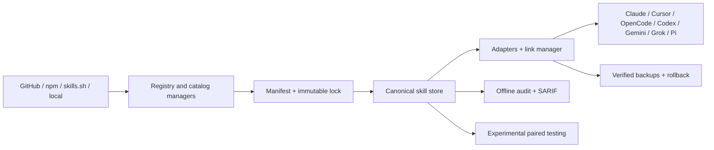

# Leogriel architecture

**Authors:** xFurti and Gabry848
**Status:** Implemented `1.0.0-beta.3` candidate; RC validation pending
**Updated:** 2026-07-18

Leogriel is a package-manager-style CLI for discovering, resolving, installing, synchronizing, auditing, and testing Agent Skills across multiple coding agents. The stable product promise is the reproducible management layer. Plugins, behavioral runners, and the composite GitHub Action remain explicitly experimental until their contracts complete RC validation.

The archived skillctl proposal and historical implementation plan are available in `docs/history/skillctl-design.md`.

## Product boundary

Leogriel owns:

- portable project dependencies in `agent-skills.json`;
- immutable resolutions and integrity in `agent-skills.lock`;
- canonical project content in `.leogriel/skills/<name>/`;
- explicit personal content in `~/.leogriel/skills/<name>/`;
- safe agent-target synchronization;
- import, update, backup, audit, completion, and diagnostics;
- optional plugin and behavioral-test subsystems.

Leogriel does not replace GitHub, npm, skills.sh, agent-native configuration, or other skill managers. It consumes supported sources and imports compatible existing installations. It does not use telemetry and does not claim that plugins or agent workspaces are absolute security sandboxes.

## System flow



## Workspace packages

All packages currently share one version and are published under `@leogriel/*`:

| Package | Responsibility | Stability |
|---|---|---|
| `cli` | Commander interface, structured output, command orchestration | RC candidate |
| `core` | Types, config, paths, hashing, parser, redaction, artifacts | RC candidate |
| `manifest` | `agent-skills.json` validation and persistence | RC candidate |
| `lockfile` | YAML lock schema and persistence | RC candidate |
| `registry` | GitHub, npm, skills.sh, and local resolution | RC candidate |
| `link-manager` | Safe symlink, junction, and managed-copy operations | RC candidate |
| `adapters` | Agent detection, target inspection, sync, and backups | RC candidate |
| `import` | Project, npx skills, and Python skillctl migration | RC candidate |
| `security` | Offline findings and SARIF | RC candidate |
| `project-state` | Cross-process locks and transactional project updates | RC candidate |
| `plugin-system` | Plugin manifest, lock, loading, and registration | Experimental |
| `testing` | AgentRunner contracts and paired behavioral tests | Experimental |

Before stable, maintainers must decide whether every workspace package is an intentional public SDK surface. Workspace separation does not require every package to receive stable public API guarantees.

## Persistent contracts

### Manifest

`agent-skills.json` uses `version: 1` semantics and separates dependencies from development dependencies. Skill names use canonical lowercase-hyphen form. Supported specifiers are:

- `github:owner/repository@ref#subpath`;
- `skills.sh/owner/repository/skill`;
- `npm:@scope/package@range`;
- `file:./project-relative-path`;
- legacy `local:imported/name`, read for migration.

### Lock

`agent-skills.lock` keeps `lockfileVersion: '1.0'`. Entries record the requested specifier, immutable resolution, canonical path, directory integrity, provenance, and source-specific metadata.

GitHub and skills.sh mutable refs resolve to a full commit SHA. npm ranges and dist-tags resolve to an exact version, tarball, and SRI. Frozen install materializes the locked source without re-resolving it.

### Integrity

The shared directory hashing algorithm is canonical across parser, lockfile, registry, audit, plugin checks, backups, and behavioral results. Compatibility with documented `0.6.x` and `0.7.x` hashes is preserved.

### Configuration

Configuration remains schema version `1` under `~/.leogriel/config.json`. New `LEOGRIEL_*` environment variables take precedence over documented legacy `SKILLCTL_*` overrides. Historical no-op `registries` and `experimental.plugins` fields are ignored; custom runtime sources and plugins use their dedicated APIs and state.

## Installation and update safety

Mutating project operations acquire locks in project-then-store order. Manifest and lock changes use a transaction journal and atomic replacement. Multi-skill updates resolve and materialize all candidates in staging before committing canonical directories and project state.

Failures restore manifest, lock, and canonical content. Frozen install rejects missing lock entries, mutable legacy remote resolutions, and integrity drift.

## Synchronization

Built-in adapters cover Claude Code, Cursor, OpenCode, Codex, Gemini CLI, Grok, and Pi. Target modes are symlink, Windows junction, or managed copy.

Target inspection distinguishes:

- `missing`;
- `current`;
- `managed-stale`;
- `unmanaged`;
- `failed`.

Unmanaged targets are never overwritten implicitly. Explicit replacement requires exact skill, adapter, scope, confirmation, and verified backup. Prune removes only targets proven to be Leogriel-managed.

## Discovery and catalog

Catalog providers are separate from installation sources. Provider IDs are unique and every result receives a provider namespace. The built-in skills.sh provider validates responses, applies timeout/retry rules, caches results for 15 minutes, and may return marked stale cache data after a network failure.

Plugins may register runtime sources and catalog providers through the experimental plugin API.

## Parser, audit, and artifacts

The shared `SKILL.md` parser validates UTF-8, size, YAML frontmatter, path containment, resources, and symlinks. It returns canonical metadata and lock-compatible integrity.

Audit is offline by default. Findings use stable categories, severity, remediation, confidence, and non-secret evidence. SARIF output is pure SARIF 2.1.0.

Artifacts are created only when explicitly requested. Writes are atomic, paths remain inside `.leogriel/artifacts/`, and centralized redaction covers structured and streaming output. Retained workspaces may still contain sensitive agent-generated files.

## Plugins

Plugins have a separate global manifest, lock, and store. npm packages are verified by SRI and installed-directory integrity. Local plugins require `--allow-local`.

Capabilities are declarations, not permissions. Plugins execute Node.js with the user's permissions and are not sandboxed. Load failures are isolated so the CLI remains available; `plugin doctor` exposes diagnostics. The plugin API remains experimental.

## Behavioral testing

Behavioral tests are versioned YAML and always pair baseline and skill variants in separate workspaces. Runs and cases are sequential. Deterministic assertions and budgets determine case pass/fail; paired transitions determine `improved`, `unchanged`, `regressed`, or `inconclusive`.

Codex is the primary runner. Claude Code is experimental on macOS, Linux, and WSL2. Both use capability detection, isolated home/config roots, credential filtering, default-deny network policy, bounded output, process-tree termination, and fail-closed configuration.

Codex live validation can use API-key mode or an explicit dedicated ChatGPT profile. Live validation is local and opt-in; maintainers do not need to store model credentials in GitHub Actions. The optional composite Action is a consumer feature, not an RC requirement.

## CLI output

First-party commands that expose `--json` emit one schema-1 envelope:

```json
{
  "schemaVersion": 1,
  "ok": true,
  "command": "doctor",
  "data": {},
  "warnings": [],
  "errors": []
}
```

Human warnings and errors use stderr. JSON stdout contains one value and no ANSI control sequences. Exit codes are `0` for success, `1` for warnings or partial operational results, and `2` for invalid input or fatal validation.

## Release model

The root workspace package is private to prevent accidental publication. Twelve scoped packages are currently packed and published in dependency order.

The release workflow:

1. validates a clean coordinated version and changelog;
2. builds and packs every package;
3. smoke-tests tarballs on Windows, macOS, and Linux;
4. publishes or verifies each package idempotently using SRI;
5. smoke-tests the actual registry package;
6. creates the annotated tag and GitHub Release only after all checks pass.

Stable releases use `latest`; prereleases use `next`. Tarballs remain attached to GitHub Releases.

## Compatibility and migration

Portable manifest and lock filenames remain unchanged after the skillctl-to-Leogriel rebrand. Leogriel reads documented legacy `.skillctl/` stores, markers, journals, plugin metadata, and environment overrides during migration. New code is published only under `@leogriel/*`.

Legacy compatibility remains through the `1.x` line unless a separate deprecation plan states otherwise.

## Stable-release criteria

`1.0.0` requires:

- a published and externally exercised `1.0.0-rc.1`;
- matching public-contract, migration, README, CLI, and package documentation;
- real local validation on supported operating systems;
- two external repositories and more than one operator;
- successful real paired runs for every runner in the stable promise;
- no unresolved error-severity audit finding;
- exercised release rerun behavior;
- a deliberate decision on public package and experimental API scope.
